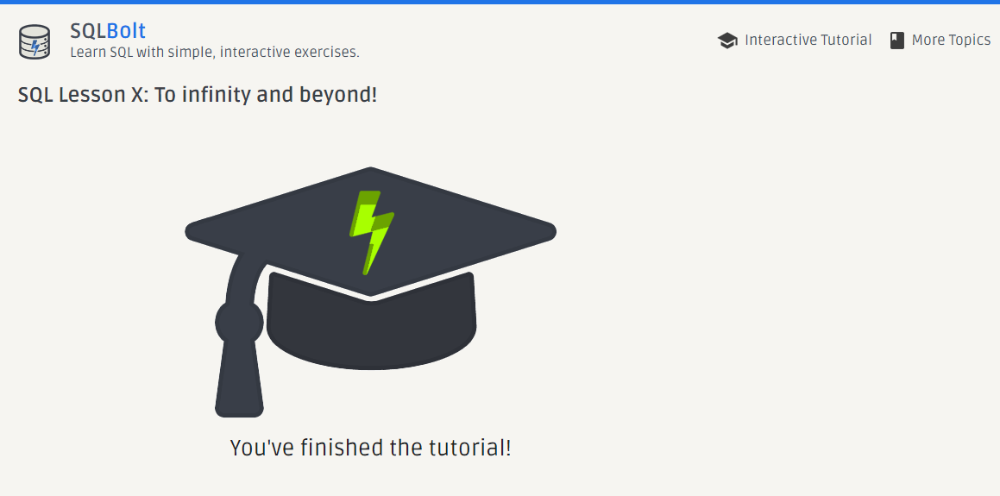

# Interactive-SQL-Workshop

This repository contains interactive SQLBolt exercises with query execution screenshots, lesson answers, and a completion certificate, documenting practical SQL query skills learned through hands-on exercises.

## Repository Contents

- Screenshots of the certificate of SQLBolt exercises completion.
- Documentation with all lesson executed screenshots and answers.

## Lessons Learned

I have gained a solid understanding of SQL fundamentals through various lessons, including:

1. SELECT queries
2. Constraints and filtering
3. JOIN operations
4. Aggregating data
5. Modifying data (INSERT, UPDATE, DELETE)
6. Table management (CREATE, ALTER, DROP)

## Conclusion

This repository serves as a testament to my growing proficiency in SQL and my commitment to continuous learning. The skills acquired here will be invaluable for future database management and data analysis tasks.
